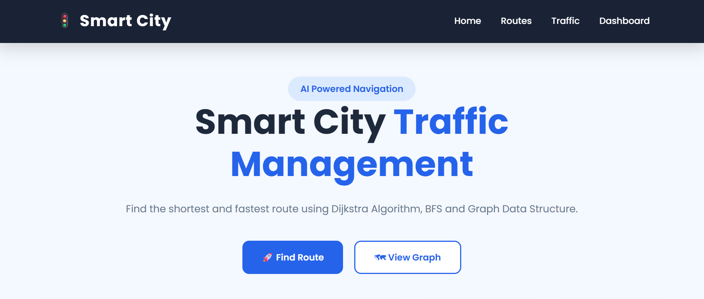

# 🚦 Smart City Traffic Management System

A modern **Smart City Traffic Management System** developed using **Graph Data Structure**, **Dijkstra Algorithm**, **BFS**, **Node.js**, **Express.js**, **HTML**, **CSS**, **JavaScript**, and **Leaflet.js**.

The system helps users find the best available route between cities, visualize the route on an interactive live map, check traffic conditions, estimate travel time, calculate fuel cost, and explore nearby places.

The upgraded system supports multiple cities across different Indian states and provides an interactive **Satellite Map**, **City Highlighting**, and **Route Visualization**.

---

# 📸 Project Screenshots

## 🏠 Home Page

---

## 🗺️ City Network

---

## 🌍 Interactive Live Map

---

## 🚗 Route Finder

---

## 🛣️ Route Visualization

---

## 📋 Route Summary

---

# ✨ Features

- 🚗 Smart Route Finder
- 🧠 Dijkstra Algorithm
- 🌐 Graph Data Structure
- 🔍 BFS Algorithm
- 🗺️ Interactive Live Map
- 🛰️ Satellite Map View
- 🗺️ Normal Map View
- 📍 Source City Highlighting
- 🎯 Destination City Highlighting
- 🛣️ Route Visualization
- 🚦 Dynamic Traffic Information
- 🟢 Low Traffic
- 🟡 Medium Traffic
- 🔴 High Traffic
- 🚗 Multiple Vehicle Support
- ⏱️ Estimated Travel Time
- ⛽ Fuel Cost Estimation
- 🏥 Nearby Places
- 🏙️ Multiple Indian Cities
- 📱 Responsive User Interface
- 🌙 Theme Support

---

# 🏙️ Supported Cities

The system currently supports multiple cities from different Indian states.

## 📍 Bihar

- Patna
- Hajipur
- Muzaffarpur
- Samastipur
- Motihari
- Bihar Sharif
- Gaya
- Ara
- Buxar
- Begusarai
- Darbhanga
- Madhubani
- Sitamarhi
- Bettiah
- Bhagalpur
- Purnia

---

## 📍 Uttar Pradesh

- Varanasi
- Prayagraj
- Lucknow
- Kanpur
- Agra
- Noida

---

## 📍 Jharkhand

- Ranchi
- Bokaro
- Dhanbad
- Jamshedpur

---

## 📍 West Bengal

- Kolkata
- Asansol
- Siliguri

---

## 📍 Delhi & Haryana

- Delhi
- Gurugram
- Faridabad

---

## 📍 Punjab

- Chandigarh
- Ludhiana
- Amritsar

---

# 🧠 Algorithms Used

## 📌 Graph Data Structure

- Cities are represented as **Nodes**
- Roads are represented as **Weighted Edges**
- Distance is used as the weight between cities
- Used to build the complete transportation network

Example:
Patna
  │
  │ 20 KM
  ▼
Hajipur
  │
  │ 52 KM
  ▼
Muzaffarpur

## 📌 Dijkstra Algorithm

Dijkstra's Algorithm is used to calculate the shortest available route between the selected source and destination cities.

### Workflow
Source
   │
   ▼
Graph
   │
   ▼
Dijkstra Algorithm
   │
   ▼
Best Available Route

The algorithm calculates:

* Best route
* Total distance
* Intermediate cities

## 📌 Breadth First Search (BFS)

BFS is used for handling nearby places based on the selected city.

Examples of nearby places include:

* 🏥 Hospitals
* 🏧 ATMs
* ⛽ Petrol Pumps
* 🍕 Restaurants
* 🏦 Banks

Future improvements can use BFS for:

* Nearest city search
* Minimum stop routes
* Emergency vehicle routing

---

# 🗺️ Interactive Live Map

The system uses **Leaflet.js** to provide an interactive city map.

Features include:

* 🛰️ Satellite Map
* 🗺️ Normal Map
* 📍 City Markers
* 🟢 Source Marker
* 🔴 Destination Marker
* 🛣️ Route Highlighting
* 🔍 Automatic Zoom
* 📌 Interactive City Popups
* 🗺️ Automatic Route Fitting

When a user selects a city, the map automatically moves to the selected location.

When a route is found, the complete route is highlighted on the map.

---

# 🚦 Traffic Management

The system supports different traffic conditions:

* 🟢 **Low Traffic**
* 🟡 **Medium Traffic**
* 🔴 **High Traffic**

Traffic conditions affect the estimated travel time.

Low Traffic
     │
     ▼
Faster Travel Time

Medium Traffic
     │
     ▼
Moderate Travel Time

High Traffic
     │
     ▼
Longer Travel Time

# 🚗 Vehicle Support

Users can select different vehicles:

* 🚗 Car
* 🏍️ Bike
* 🚌 Bus

Each vehicle has a different average speed.

The estimated travel time depends on:

Distance
   +
Vehicle Speed
   +
Traffic Condition
   =
Estimated Travel Time

# 🛠️ Tech Stack

## Frontend

* HTML5
* CSS3
* JavaScript
* Leaflet.js
* OpenStreetMap
* Esri Satellite Map

## Backend

* Node.js
* Express.js
* REST API
* CORS

## Algorithms

* Graph Data Structure
* Dijkstra Algorithm
* BFS Algorithm

## Version Control

* Git
* GitHub

---

# 📂 Folder Structure

Smart-City-Traffic-Management-System
│
├── client
│   │
│   ├── assets
│   │   ├── HomePage.png
│   │   ├── City Network.png
│   │   ├── Live Map.png
│   │   ├── Route Finder.png
│   │   ├── City Woking Map.png
│   │   └── Route Summary.png
│   │
│   ├── css
│   │   └── style.css
│   │
│   ├── js
│   │   ├── app.js
│   │   ├── map.js
│   │   └── theme.js
│   │
│   └── index.html
│
├── server
│   │
│   ├── algorithms
│   │   ├── bfs.js
│   │   ├── dijkstra.js
│   │   └── graph.js
│   │
│   ├── controllers
│   │   ├── cityController.js
│   │   ├── placeController.js
│   │   └── routeController.js
│   │
│   ├── routes
│   │   ├── city.js
│   │   ├── place.js
│   │   └── route.js
│   │
│   ├── services
│   │   └── routeService.js
│   │
│   ├── data
│   │   ├── cities.js
│   │   ├── cityCoordinates.js
│   │   ├── places.js
│   │   └── roads.js
│   │
│   └── server.js
│
├── Smart-City-Traffic-Management-System.pptx
│
└── README.md

# ⚙️ Installation

Clone the repository: git clone https://github.com/saumyamihir/Smart-City-Traffic-Management-System.git

Move into the project directory: cd Smart-City-Traffic-Management-System

Install backend dependencies:
cd server
npm install

Start the backend server:
node server.js

The backend will run on: http://localhost:5000

Open the frontend using **Live Server**.
Open: client/index.html

# 🔌 API Endpoints

## 📍 Get All Cities

GET /api/cities
Example:
http://localhost:5000/api/cities

## 🛣️ Find Route

GET /api/route
Example:
/api/route?source=Patna&destination=Muzaffarpur&vehicle=Car

## 📍 Get Nearby Places

GET /api/places

Example:

/api/places?city=Patna

# 🚦 Route Calculation

The system performs the following steps:

User Input
     │
     ▼
Select Source & Destination
     │
     ▼
Select Vehicle
     │
     ▼
Graph Construction
     │
     ▼
Dijkstra Algorithm
     │
     ▼
Best Available Route
     │
     ▼
Traffic Analysis
     │
     ▼
Estimated Travel Time
     │
     ▼
Fuel Cost
     │
     ▼
Nearby Places
     │
     ▼
Map Route Highlight

# 🔮 Future Enhancements

* 🤖 AI-based Traffic Prediction
* 📡 Real-time Traffic API Integration
* 🚑 Emergency Vehicle Routing
* 📍 GPS Navigation
* 🛰️ Real Road Routing
* 🚗 Live Vehicle Tracking
* 📊 Traffic Analytics Dashboard
* 🔔 Real-time Traffic Alerts
* 🚦 Smart Traffic Signal Control
* 📱 Mobile Application

# 👨‍💻 Developers

* **Saumya Mihir**
* **Naureen**
* **Shubham Yadav**

GitHub:

[https://github.com/saumyamihir](https://github.com/saumyamihir)

# 📄 License

This project is developed for **educational**, **internship**, and **learning** purposes.

## ⭐ If you like this project, don't forget to give it a Star on GitHub!

🚦 **Making city transportation smarter through algorithms, route optimization, and interactive maps.**

